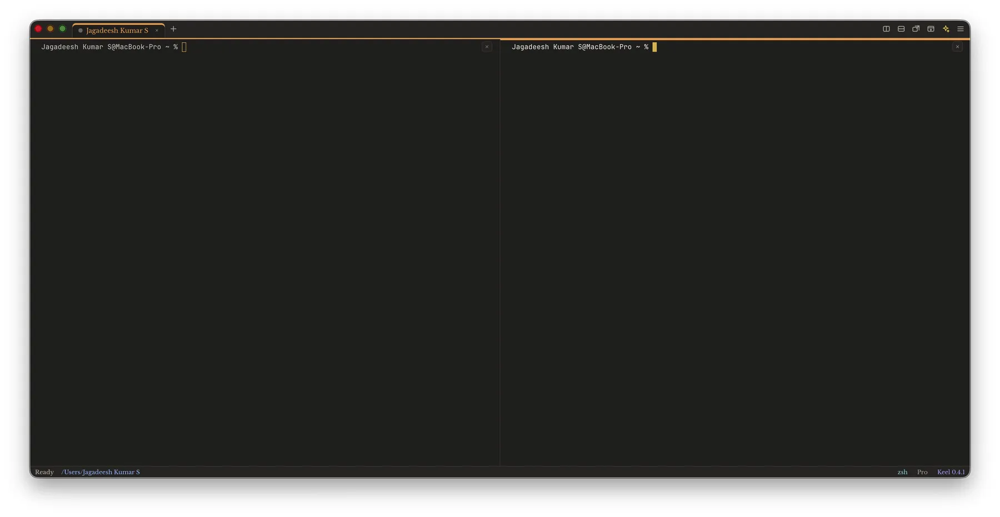
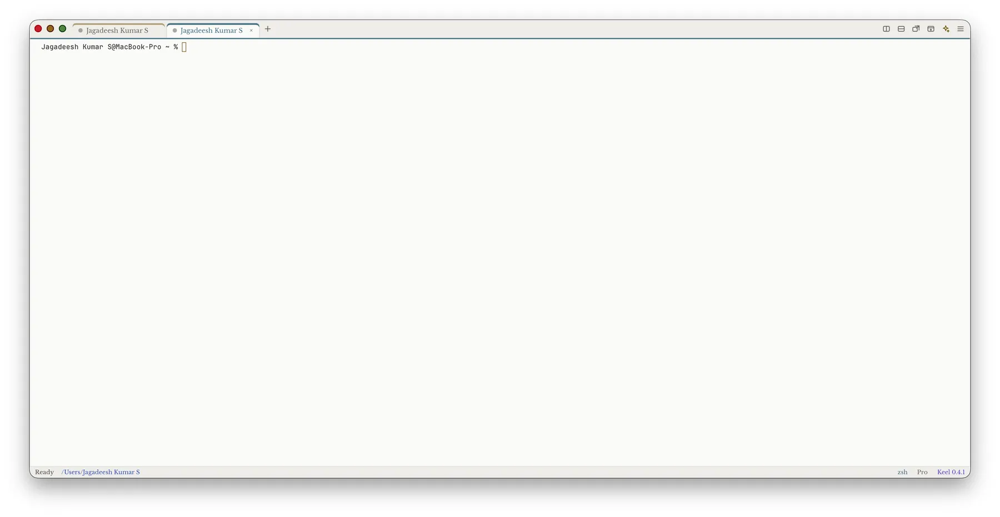
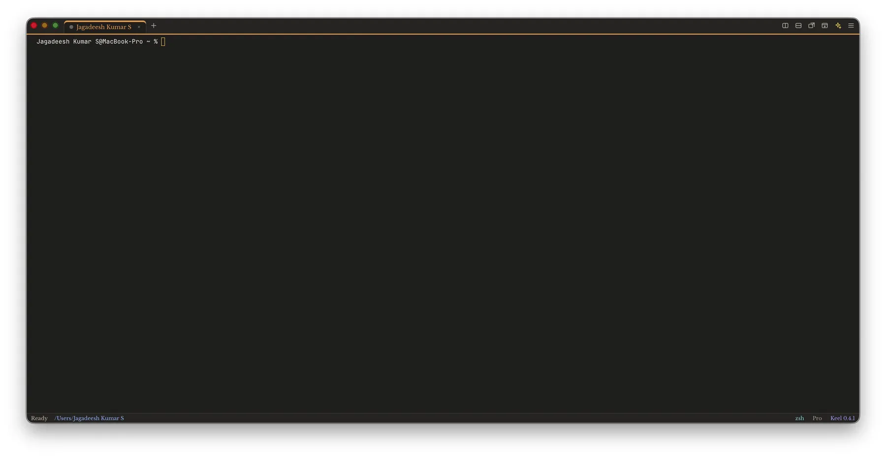
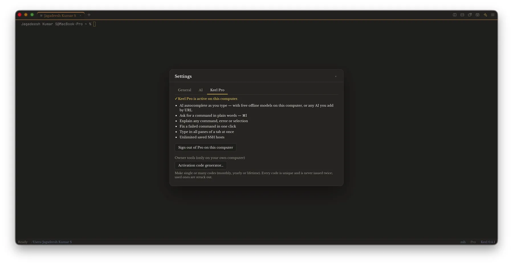
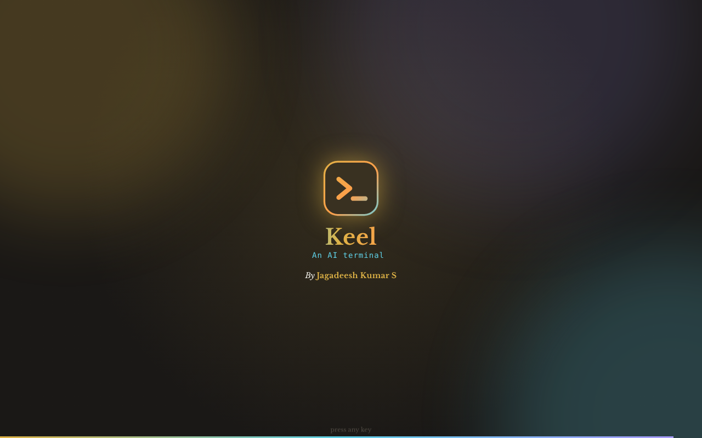
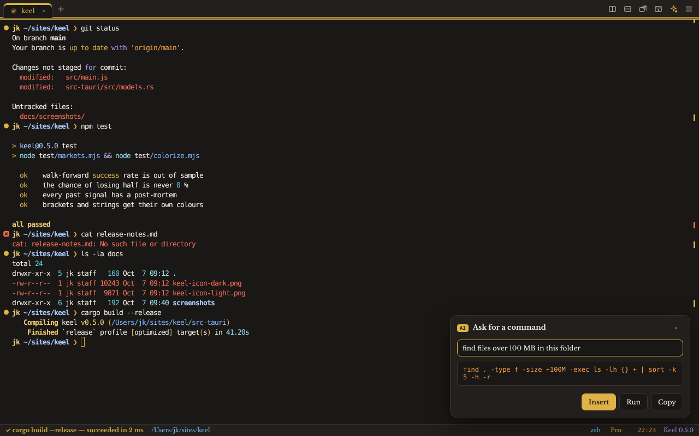
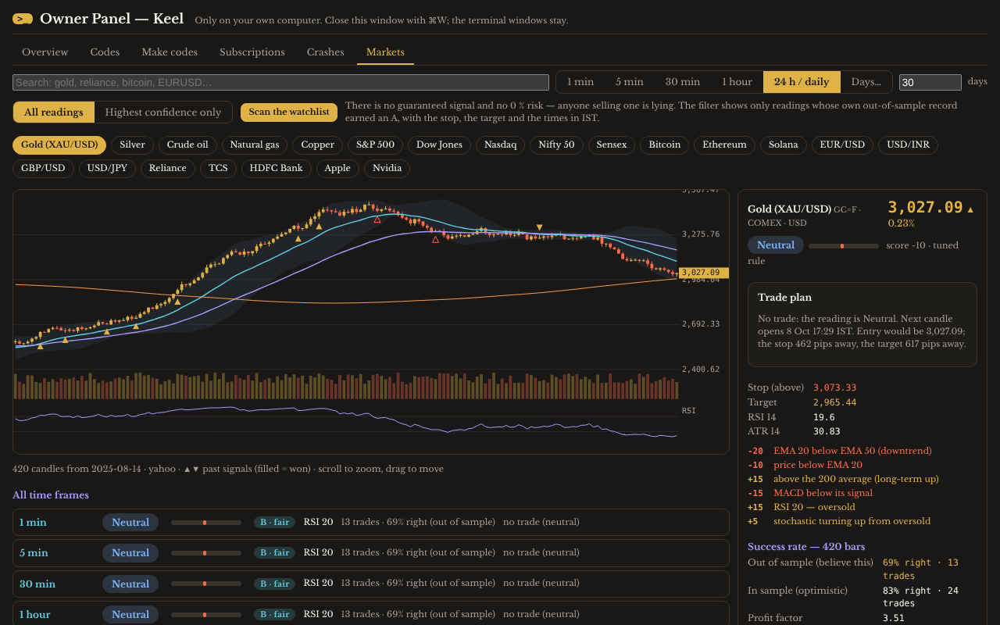
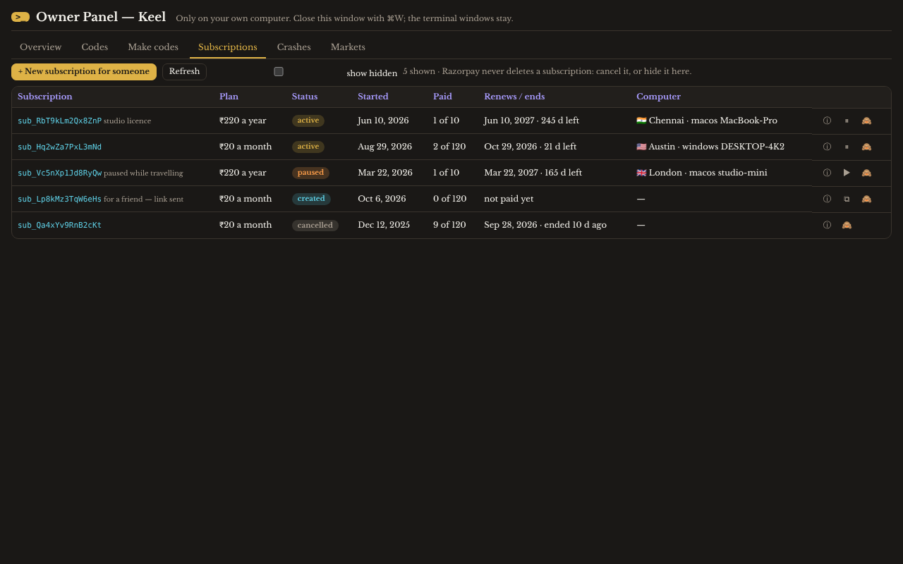
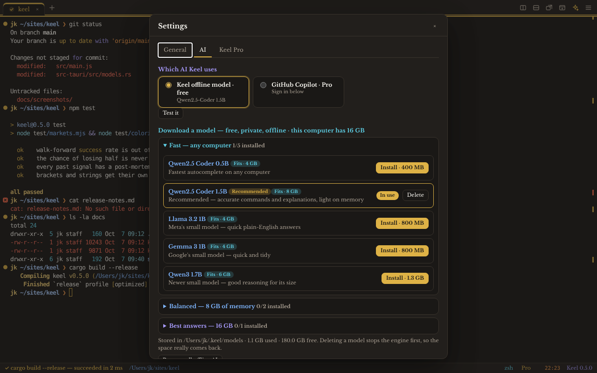

<p align="center">
  <picture>
    <source media="(prefers-color-scheme: dark)" srcset="assets/keel-icon-dark.png">
    _ prompt on a rounded square">
  </picture>
</p>
<p align="center">
   &nbsp; 
</p>

# Keel — AI Terminal

An AI terminal for macOS, Windows and Linux that shows at a glance which commands worked and which failed, with offline AI that is free for everyone.

**Website:** [ipconfig.co.network](https://ipconfig.co.network) · **App page:** [ipconfig.co.network/keel](https://ipconfig.co.network/keel) · **Releases:** [github.com/JKS-sys/keel-releases-29-sep-2026/releases](https://github.com/JKS-sys/keel-releases-29-sep-2026/releases)

**Latest: [Keel 0.4.5](https://github.com/JKS-sys/keel-releases-29-sep-2026/releases/tag/v0.4.5) — 08-oct-2026** · [release notes](https://ipconfig.co.network/updates/keel/release-notes-0.4.5.md)

## Install

**macOS — one command, no `brew tap` step (Homebrew adds the tap itself):**

```sh
brew install --cask jks-sys/tap/keel
```

**macOS or Linux — one command, no Homebrew, no tap, no repository (curl):**

```sh
curl -fsSL https://ipconfig.co.network/updates/keel/install.sh | bash
```

It downloads the right installer for your computer from the release, checks its SHA-256 against `latest.json`, installs it and clears Gatekeeper's quarantine mark. Add `-s -- --version 0.4.5` after `bash` for exactly this version.

**macOS — by hand:** download the DMG for your Mac ([Apple silicon](https://github.com/JKS-sys/keel-releases-29-sep-2026/releases/download/v0.4.5/Keel-0.4.5-macos-apple-silicon-08-oct-2026.dmg) · [Intel](https://github.com/JKS-sys/keel-releases-29-sep-2026/releases/download/v0.4.5/Keel-0.4.5-macos-intel-08-oct-2026.dmg)), drag Keel to Applications, then run once in Terminal: `xattr -cr /Applications/Keel.app`. Keel is not notarised with Apple, so macOS asks once; after that it opens like any other app.

**Windows:** download [the installer](https://github.com/JKS-sys/keel-releases-29-sep-2026/releases/download/v0.4.5/Keel-0.4.5-windows-08-oct-2026.exe) and run it. SmartScreen asks once — *More info → Run anyway*.

**Linux:** install [the .deb](https://github.com/JKS-sys/keel-releases-29-sep-2026/releases/download/v0.4.5/Keel-0.4.5-linux-08-oct-2026.deb) with your package manager (`sudo apt install ./Keel-0.4.5-linux-08-oct-2026.deb`), or make [the AppImage](https://github.com/JKS-sys/keel-releases-29-sep-2026/releases/download/v0.4.5/Keel-0.4.5-linux-08-oct-2026.AppImage) executable (`chmod +x`) and run it. There is an [.rpm](https://github.com/JKS-sys/keel-releases-29-sep-2026/releases/download/v0.4.5/Keel-0.4.5-linux-08-oct-2026.rpm) too.

> Plain `brew install --cask keel` (no tap name at all) works only once Keel is accepted into Homebrew's own cask list, which needs a project with enough stars and forks; until then the one-command forms above are the way.

Keel updates itself: every launch checks `https://ipconfig.co.network/updates/keel/latest.json` (and the GitHub releases as a second source), and an update installs from the status bar.

| Computer | Download |
|---|---|
| Mac with Apple silicon (M1 and later) | [Keel-0.4.5-macos-apple-silicon-08-oct-2026.dmg](https://github.com/JKS-sys/keel-releases-29-sep-2026/releases/download/v0.4.5/Keel-0.4.5-macos-apple-silicon-08-oct-2026.dmg) |
| Mac with Intel | [Keel-0.4.5-macos-intel-08-oct-2026.dmg](https://github.com/JKS-sys/keel-releases-29-sep-2026/releases/download/v0.4.5/Keel-0.4.5-macos-intel-08-oct-2026.dmg) |
| Windows | [Keel-0.4.5-windows-08-oct-2026.exe](https://github.com/JKS-sys/keel-releases-29-sep-2026/releases/download/v0.4.5/Keel-0.4.5-windows-08-oct-2026.exe) |
| Linux (AppImage) | [Keel-0.4.5-linux-08-oct-2026.AppImage](https://github.com/JKS-sys/keel-releases-29-sep-2026/releases/download/v0.4.5/Keel-0.4.5-linux-08-oct-2026.AppImage) |
| Linux (.deb) | [Keel-0.4.5-linux-08-oct-2026.deb](https://github.com/JKS-sys/keel-releases-29-sep-2026/releases/download/v0.4.5/Keel-0.4.5-linux-08-oct-2026.deb) |
| Linux (.rpm) | [Keel-0.4.5-linux-08-oct-2026.rpm](https://github.com/JKS-sys/keel-releases-29-sep-2026/releases/download/v0.4.5/Keel-0.4.5-linux-08-oct-2026.rpm) |

## Screenshots



*Keel on the Mac: two panes side by side, each its own shell, the active one marked in gold. ⌘D splits right, ⇧⌘D splits down, and a divider drags.*



*The light theme, two tabs, every tab in its own colour. Appearance follows the system or is set by hand.*



*The dark theme: warm black, gold and warm white, straight from the app icon. The status bar shows the shell, the plan and the version.*



*Settings → Keel Pro on the owner’s Mac: what Pro adds, and the way into the Owner Panel.*



*The terminal: every command gets a mark — gold when it worked, a red badge that says why when it failed — and the tab icon animates with what is running. Plain output is coloured: numbers, paths, strings, brackets by depth.*



*AI in the terminal: ask with `#` at the prompt or ⌘I and get the exact command back. Offline models are free for everyone; Copilot and online services are Pro.*



*Markets, in the Owner Panel window: candles, a reading with its reasons, the trade plan in pips with the entry and take-profit times in IST, the out-of-sample success rate and a confidence grade — never a guarantee.*



*The Owner Panel: subscriptions in detail — create one for someone, pause, resume, change the plan, note, hide, cancel — codes, crash reports, Markets.*



*Settings → AI: a catalogue of offline models that fit this computer, any GGUF file or folder, Hugging Face links, AI apps already running here, GitHub Copilot, services by URL.*

## What's new in 0.4.5

- **No more "Keel would like to access files in your Downloads folder" after every update.** macOS remembers that answer per code identity, and every build used to be a new one (ad-hoc signed). `update.sh` now makes a signing certificate once on the Mac and signs every release with it, so the answer sticks across updates. Keel also no longer looks in Downloads for AI models on its own (add that folder by hand if you keep models there).
- **"Paste 4 lines?" — Always paste.** One click stops the question for good; Settings → Notifications brings it back.
- **Forex works:** prices show the decimals currency pairs move in (EUR/USD 1.12473, USD/INR 83.1234) — two decimals made every forex price, the chart axis, the stop and the target read "1.12". EURUSD, EUR/USD, USDJPY, XAUUSD typed in search now find the right Yahoo symbol, and AUD/USD, USD/CAD, USD/CHF, NZD/USD, EUR/JPY, EUR/GBP and EUR/INR join the watchlist (with Stooq daily history behind them).
- **Transparency fixed:** the window now goes see-through and the text stays solid. xterm keeps text readable by comparing it with the background, and the transparent background it was given counted as black — so in the light theme dark text was flipped to light, the opposite of what you asked for.
- **A new start-up, made with /ship like Twig's:** the tile draws itself, the >_ follows, sparks fly, "Keel" rises in a shimmering gradient, "An AI terminal" types itself, "By Jagadeesh Kumar S" fades in, over drifting colour and a sweep line — with the /ship start-up chord. Any key or click skips it.
- **More colour, no pink:** the prompt itself (user@host gold, the folder blue, (venv) and [branch] cyan, the sign violet) when your shell prints it plain; the status bar in colour; three more sound packs (Crisp, Wood, Space); ripples on buttons.

- **The Owner Panel is a window of its own** (⌥⌘O, or Keel → Owner Panel; Markets opens it on the Markets tab) — the terminal windows stay as they are. Subscriptions now have the full set of operations: create one for someone (Razorpay's payment page comes back to send), pause, resume, change the plan now or at the period's end, undo a scheduled change, a note, hide, cancel. Crash reports are readable in full, deletable one by one or all at once, exportable as .md or .txt to Downloads, with the crash folder one click away.
- **Markets: the trade plan, in pips and in Chennai time.** Every reading says BUY or SELL, the entry at the next candle's open with its time in IST, the stop-loss and the take-profit in price and in pips, reward-to-risk, when past winners typically reached the target (a take-profit time in IST — an estimate from the record, never a promise) and how past signals ended. A confidence grade (A, B, C) comes from each instrument's own out-of-sample record; *Highest confidence only* shows the A readings and *Scan the watchlist* reads every instrument one after another. The rule now re-tunes itself whenever new candles arrive and keeps a log, so the panel shows how its out-of-sample rate moved. There is no guaranteed signal and no 0 % risk, and the panel says so — anyone selling one is lying.
- **"The data source is busy" fixed:** requests to one source are spaced 1.2 s apart, the time-frame rows load one after another instead of all at once, "too many requests" is retried on Yahoo's other host after a pause (with a session cookie and crumb when Yahoo wants one), Binance and Coinbase answer for crypto, Stooq for daily history of the big commodities, indices, currency pairs and US shares, and the last saved answer comes before an error.
- **Start-up animation with a chord**, like Swep: the mark draws itself, "An AI terminal" rises; off in Settings → Motion or with Reduce motion.
- **Transparency** — Settings → Appearance → Transparency: the desktop shows through, with the system's blur behind it on macOS and Windows.
- **24-hour time** everywhere: the status-bar clock, the Owner Panel, crash reports, Markets.
- **More colour, no pink:** git diff lines, markdown headings, comments, tool names, code keywords, git refs, host:port, money, hex colours, units, signed numbers (gold up, red down).
- **Security:** Vite 7 (no vulnerable build tooling), per-address limits on activation attempts and crash reports in the Worker, a nonce-based CSP on the owner page, `nosniff` and `no-referrer` on every Worker answer, https-only HTTP with the scheme pinned in curl, the app's CSP enforced in the UI tests, `cargo audit` and `npm audit` clean.
- **Release notes everywhere:** `release-notes-<version>.md` and `release-notes.md` (every version) go to GitHub and R2 with every release; everything old is removed from R2 after a successful upload.
- The font's name no longer appears anywhere in the app.

- **Keel is an AI terminal.** The offline AI — Keel's own engine and any GGUF model — is now **free for everyone**, not only Keel Pro. GitHub Copilot (sign in with the browser) and AI services by URL are the Pro part.
- **Any local AI model.** Twenty catalogue models in four groups marked by what fits this computer's memory; any `.gguf` file or folder (split files grouped); Hugging Face links checked by Hugging Face's own SHA-256; models that Ollama, LM Studio, Jan, GPT4All, llama.cpp, LocalAI, vLLM, text-generation-webui or llamafile already hold, found on their ports. Deleting a model stops the engine (and any stray one) first and checks the file is gone, so the disk space really comes back.
- **Crash reports.** A crash is written to `~/.keel/crashes` (the error and the place in Keel's code — never your commands, output or files); Keel offers to send it, the owner reads it in the Owner Panel, and the fix follows. Settings → Crash reports: ask, always, never.
- **Markets, honest.** Signals for commodities, indices, shares, crypto and forex on 1 m, 5 m, 30 m, 1 h, daily or any number of days, over all the history the source has. Every signal carries its backtest, its **out-of-sample** success rate from walk-forward testing, a self-tuned rule, a post-mortem of every past signal, position size and the chance of a losing run — which is never 0 %. No tool can promise a 1000 % success rate or zero risk, and Keel does not.
- **Owner Panel** on the owner's Mac: subscriptions in detail (status, payments, customer, the computer each is used on), activation codes by lifetime / days / months / years, each code's state, IP, place, system, activation and end dates, history; withdraw, delete (a tombstone stays — a code is never issued twice), restore, notes, CSV; crash reports; charts, sounds and motion.
- **Install with one command:** `brew install --cask jks-sys/tap/keel` (no `brew tap` step — the cask is published to the tap with every release, with both DMG checksums and `depends_on macos: :big_sur`, so the deprecation warning is gone) or `curl -fsSL https://ipconfig.co.network/updates/keel/install.sh | bash` (no Homebrew, no tap, no repository; checks the SHA-256 and clears the quarantine mark). Linux: the `.deb` with your package manager, or the AppImage made executable.
- **Releases:** the release notes go to R2 as `release-notes-<version>.md`, the curl installer goes with every release, the public README carries both icons, four screenshots and the install block, and once a release is complete on all four platforms and mirrored to R2 the previous releases are deleted from both GitHub repos — only the newest installers stay. The size limit is now 5 MB.
- **Gatekeeper, fixed:** clearing the quarantine mark works on paths with spaces and quotes (the fix script was being given quoted paths).
- **Windows that can be seen:** a new or split window is always placed on a visible screen, never off-screen or on a full-screen Space; the Dock's Reopen no longer piles up extra windows; windows are named by their tab and folder.
- **Colour everywhere, no pink:** more tokens coloured in output and in what you type — brackets by depth, strings, numbers, paths, flags, keywords — in every pane and tab.
- **More sounds, motion and graphics:** five sound packs, animated tiles, bars and chips in the panels, confetti when codes are made; Reduce motion turns it all off.
- **Fixed:** Settings → AI showed the word “null” where an empty section was (every panel now skips empty parts); typed-ahead scripts no longer get swallowed by a starting shell; deleted models no longer linger on disk; the About section fits one screen with release notes paged.

- **`.command` files run when opened with Keel.** Keel now waits for the shell's first prompt before typing the script (it used to be typed too early and swallowed, leaving an empty tab), picks up files macOS hands over while Keel is still starting, and runs scripts that lost their execute bit through their `#!` line.
- **Folders open with Keel:** right-click a folder → Open With → Keel (on Windows, “Open in Keel”) for a new tab in that folder.
- **Window names in the Dock:** right-clicking Keel in the Dock lists each window by its tab and folder, not “Keel” for all of them.
- **Animated tab icons** for what each tab is doing — building, downloading, testing, serving, SSH, git, editing, scripts and more — each in its own colour, never pink.
- **A new failure badge** in place of the red ✕: its colour and mark say why — error, command not found, not allowed, wrong usage, stopped with Ctrl-C, crashed.
- **Sounds and animation:** a chime when a command works, a low tone when it fails, ticks for tabs; Settings → Sounds and Motion.
- **About fits on one screen:** two columns; only the newest release notes are open, older versions are one click away.
- **Colour everywhere, no pink:** plain output is coloured for you — numbers, paths, quoted text, links, `key=value`, errors and warnings — and brackets are coloured by depth so pairs match at a glance. What you type in zsh is coloured too: real commands gold, unknown ones red, flags, strings and paths each their own colour. Every tab has its own colour, carried along the top of its panes.
- **Open scripts with Keel:** right-click a `.command` or `.sh` file → Open With → Keel, and it runs in a new tab in its own folder. Folders open a tab there.
- **Drag files in:** drop a file on the terminal and its path is typed at the cursor, quoted if it has spaces.
- **One About section** with the app, its release notes and the creator.
- **More terminal comforts:** find with case, whole-word and regex; clickable links; copy on select; Option as Meta; ⌥←/⌥→ word jumps; ⌘⌫ clears the line; visual bell; Save Output to Downloads; Open Current Folder; Reset; Scroll to top/bottom; tabs come back next time; a question before closing something still running.
- **Releases fixed:** a home folder with spaces in its name no longer produces an empty version; every release checks the version online and carries its number, date and notes.

## Features

- **See at a glance what worked.** A gold mark beside every command that succeeded and a failure badge whose colour and mark say why — a cross for an error, ? for “command not found”, a barred circle for “not allowed”, a square for Ctrl-C — with the exit code and time, in the gutter, on the scrollbar, on the tab and in the status bar.
- **Offline AI, free for everyone.** Install a model in Settings → AI (a catalogue of 20, from 400 MB up, marked by what fits this computer's memory), or use any GGUF file, folder, Hugging Face link, or an AI app already running here — Ollama, LM Studio, Jan, GPT4All, llama.cpp, LocalAI, vLLM, text-generation-webui, llamafile. Keel's own engine runs it on this computer only; nothing leaves your Mac. Deleting a model really frees the disk (the engine is stopped first and the deletion is verified).
- **Ask, Explain, Fix, autocomplete.** Type `# what you want` at the prompt or press ⌘I for one exact command; ⇧⌘E explains the last command or error; ⇧⌘F fixes a failed one; grey suggestions as you type come first from your history, then exact completions (git, brew, docker, npm, cargo subcommands, branches, scripts, Makefile targets, SSH hosts), then the AI.
- **GitHub Copilot and AI services by URL** (Keel Pro) — sign in to Copilot in the browser; add OpenAI, Gemini, Groq, Mistral, DeepSeek, OpenRouter or any OpenAI-compatible server by its URL.
- **Markets** (on the owner's Mac): signals for commodities, indices, shares, crypto and forex on 1 m, 5 m, 30 m, 1 h, daily or any number of days, over all the history the source has. A trade plan for every reading — side, entry at the next candle's open, stop-loss and take-profit in pips, the times in Chennai (IST) — a confidence grade from the out-of-sample record with a "highest confidence only" filter and a watchlist scan, a rule that re-tunes itself as candles arrive and shows how its record moved, post-mortems of every past signal, position size and the chance of a losing run. Yahoo, Binance, Coinbase and Stooq as sources, spaced out so none refuses — honest numbers, never a promise.
- **Start-up, like Twig's** — the tile draws itself, sparks fly, "Keel" rises, "An AI terminal" types itself, "By Jagadeesh Kumar S" fades in, with a synthesised start-up chord; any key skips it; off in Settings → Motion or with Reduce motion.
- **Paste without the question** — "Always paste" stops the several-lines question for good; Settings brings it back.
- **macOS asks for Downloads once, not after every update** — every release is signed with the same identity, so macOS remembers.
- **Transparency** — Settings → Appearance → Transparency lets the desktop show through, with the system's blur behind it on macOS and Windows.
- **24-hour time** everywhere: the status-bar clock, the Owner Panel, crash reports, Markets.
- **Animated tab icons** — each tab shows what it is doing: building, downloading, uploading, testing, serving, editing, git, SSH, sudo, AI or a script, each in its own colour (never pink).
- **Sounds and motion** — five sound packs, a chime when a command works, a low tone when it fails, ticks for tabs; choose off, failures only, long commands, or everything. Reduce motion turns the animation off.
- **Tabs, splits and windows** — drag a tab out for its own window, drag another tab onto the terminal to join it as a split, move a pane back to a tab, merge all windows, resize splits by dragging. Windows always open on a screen you can see, and the Dock's right-click menu names each window by its tab and folder.
- **Open scripts and folders with Keel** — right-click a `.command` or `.sh` file → Open With → Keel and it runs in a new tab in its own folder once the shell is ready. Right-click a folder → Open With → Keel, or Finder's “New Keel Tab Here” Quick Action.
- **Gatekeeper, fixed** — *Clear quarantine* on any file or app from Keel (paths with spaces and quotes included), so “Apple could not verify…” goes away.
- **Crash reports** — a crash is written to `~/.keel/crashes`; Keel offers to send it (never without a yes) and the owner reads it in the Owner Panel. No commands, output or file names are ever in a report.
- **Owner Panel**, a window of its own (on the owner's Mac only): subscriptions in detail with create / pause / resume / change plan / note / hide / cancel, activation codes by lifetime / days / months / years, each code's state, IP, place, computer, activation and end dates; withdraw, delete, restore and annotate codes; crash reports readable in full, deletable and exportable as .md or .txt; charts, sounds and motion.
- **Drag files in**, click to move the cursor inside the command you are typing, find with case/whole-word/regex, clickable links and paths, copy on select, Option as Meta, save output, open the current folder, snippets, a command palette, and your tabs and folders come back next time.
- **Colour everywhere, no pink** — plain output is coloured for you (numbers, paths, strings, links, errors, `key=value`), brackets by depth so pairs match, what you type in zsh by meaning, and every tab in its own colour. Light and dark themes follow your system.
- **Small** — the whole app is under 5 MB (CI refuses anything bigger); no browser engine bundled.
- **Keel Pro** — ₹20 a month or ₹220 a year, or an activation code (needs the internet once). The terminal, the marks and the offline AI are free for good, with no limits on hosts, tabs or snippets.
- **Updates itself**, checking every download twice (SHA-256 and an Ed25519 signature) before installing it. Release notes for every version are at `https://ipconfig.co.network/updates/keel/release-notes-<version>.md`.

---
Made by Jagadeesh Kumar S, creator · [NewsCraft Studio on YouTube](https://www.youtube.com/@JKS-sys) · [ipconfig.co.network](https://ipconfig.co.network)